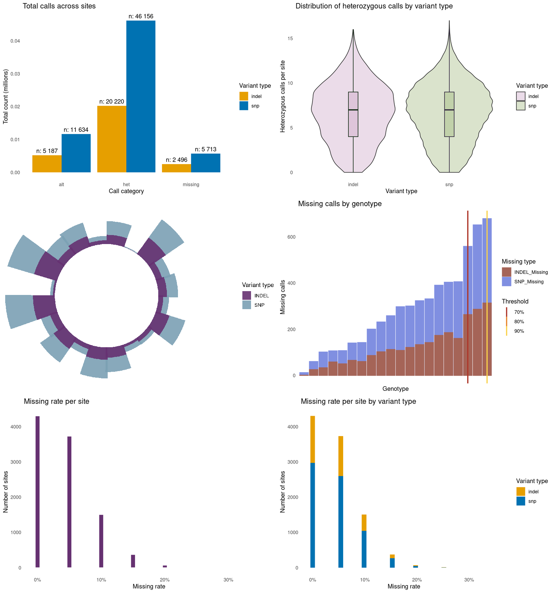

# VCF File Analyzer

This project is a **Quarto report** designed to run in **RStudio**. It combines **Python** (for parsing the VCF) and **R** (for tables and plots) to produce an HTML report.  
The focus is a **first-pass QC on missing data** in a multi-sample VCF (many individuals, many sites).

## Features

- **Missingness at site and genotype level** (SNP vs INDEL).
- **Quick summary tables** for the most problematic genotypes.
- **Clear visual overview** to spot outliers and set thresholds.

## Prerequisites

You can run the report directly in RStudio (local install) or use Docker.

**Local setup (RStudio):**
- Python 3.10+
- R 4.1+
- Quarto (via RStudio)
- Python package `cyvcf2`
- R packages listed below

**Docker option (recommended):**  
Use the prebuilt image `nutui/vcf-analyzer` which includes everything.

## Installation

1. Clone the repository:

```bash
git clone https://github.com/BaptisteHerlemont/VCF_Analyzer-.git
```

2. Install Python dependency:

```bash
pip3 install cyvcf2
```

3. Install R packages (run in RStudio):

```r
install.packages(c(
  "ggplot2", "dplyr", "knitr", "MetBrewer",
  "tidyr", "plotly", "viridis", "reticulate"
))
```

## Docker (RStudio Server)

This Docker image includes **R**, **Python**, **Quarto**, `cyvcf2`, and all required R packages.  
It lets anyone open RStudio in the browser and render `vcf.qmd` without local installs.

**Pull and run RStudio Server:**
```bash
docker pull nutui/vcf-analyzer:latest
docker run --rm -p 8787:8787 \
  -v "$(pwd)":/home/rstudio/project \
  nutui/vcf-analyzer:latest
```

Then open `http://localhost:8787` in your browser (no login required).
Use only on trusted/local machines (authentication is disabled).


## Usage

1. Put your VCF in the same folder as `vcf.qmd`.
2. Open `vcf.qmd` in RStudio and edit the file names in the setup chunk:

```r
{r setup, include=FALSE}
input_vcf_file <- "YourInputFileName.vcf.gz"
output_csv_file_bySite <- "OutputFileNameBySite.tsv"
output_csv_file_byGeno <- "OutputFileNameByGeno.tsv"
```

3. Render the report (Knit/Render).  
The script will:

- parse the VCF in **Python** (`cyvcf2`)
- write two TSVs: per-site and per-genotype
- read them in **R** and generate plots + tables

The HTML report and TSV files are written to the project folder.

**Tip:** This report is most useful for VCFs with multiple individuals and sites, where missingness varies across genotypes.  
For a quick demo, you can use the included example file `synthetic_20ind_10k.vcf`.  
This example file comes from the repository `BaptisteHerlemont/Fake_bioinfo_data_maker`: https://github.com/BaptisteHerlemont/Fake_bioinfo_data_maker


## Report Preview

Below is a compact overview of the figures you can expect.  
The file `docs/report-overview.png` can be used as an example screenshot to show what the script produces.


